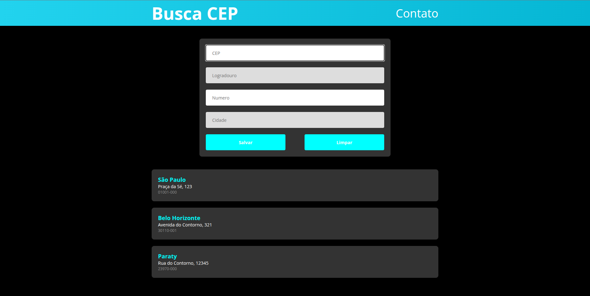

# Busca CEP

Aplicação desenvolvida para consulta de endereços brasileiros utilizando a API ViaCEP. O objetivo deste projeto foi aplicar conceitos de JavaScript assíncrono e organização de código baseada em módulos.

---

## Funcionalidades

- Busca de CEP usando a API ViaCEP
- Preenchimento automático de rua e cidade
- Se a rua não for encontrada, o campo fica habilitado para digitação
- Validação de campos obrigatórios
- Listagem dos endereços salvos
- Design responsivo

---

## Tecnologias

- HTML5
- CSS3
- JavaScript ES6
- API ViaCEP

---

## Estrutura do código

* **Controllers**: Gerenciam a captura de eventos, manipulação do DOM e a lógica de exibição das telas.
* **Services**: Contêm a lógica de negócio, como a validação de dados e as requisições HTTP.
* **Models**: Define a estrutura do objeto de endereço utilizado em toda a aplicação.
* **Styles**: Estilização modularizada, separando o CSS geral dos componentes específicos como o modal.

---

## Como Rodar

Para visualizar o projeto localmente, é necessário utilizar um servidor local (como a extensão Live Server do VS Code) devido ao uso de módulos JavaScript.

1. Faça o download ou clone do repositório.
2. Inicie o servidor local a partir do arquivo `index.html`.
3. Digite um CEP válido para testar a busca.
